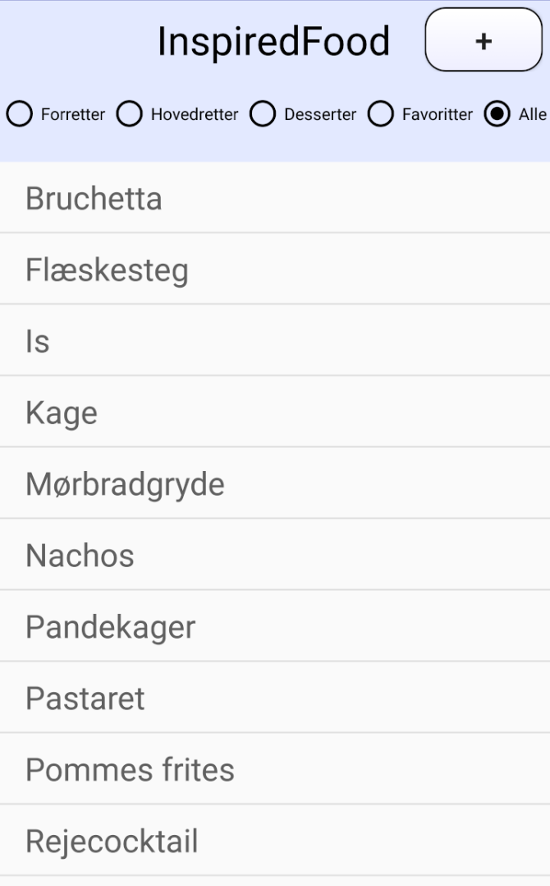
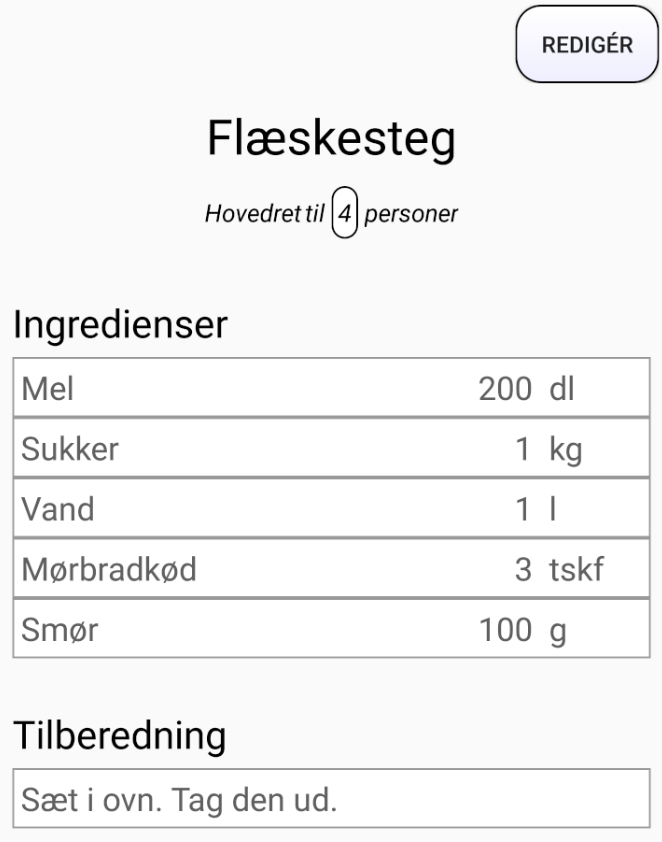
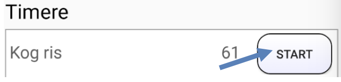
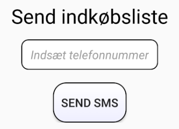
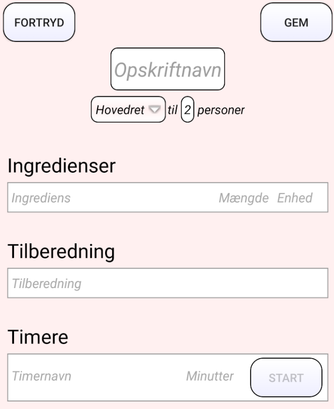
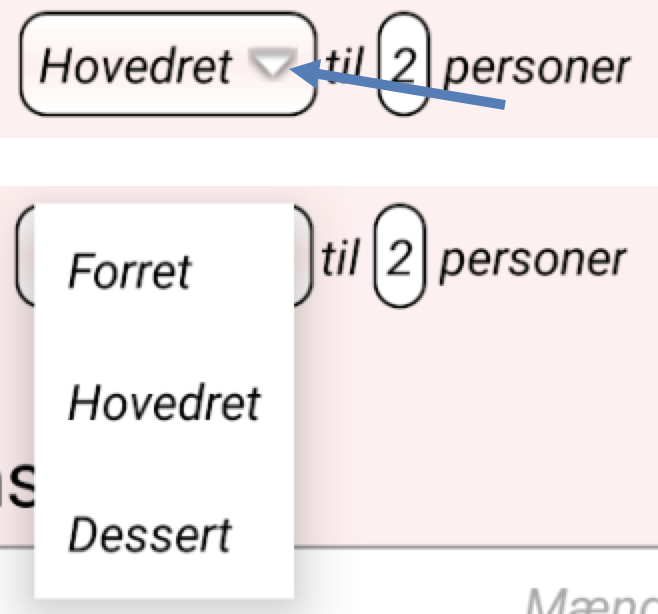

**Fag:	Programmering af mobile enheder**

**Hold:	s17apme1pab1**

**Vejleder:	Anders Kalhauge**

**Deltagere:	Pia Jensen & Carsten Brandt**

# Problemformulering
Som afslutning på faget Programmering Af Mobile Enheder har vi fået til opgave at udvikle en app med valgfrit indhold. Applikationen skal udvikles til Android-styresystemet og skal skrives i det nye programmeringssprog Kotlin.

Vi har besluttet os for at lave en kogebogs-app med titlen InspiredFood, som dels skal fungere som et opslagsværk og give inspiration til valg af madretter, og dels give mulighed for features som en traditionel kogebog ikke kan tilbyde, såsom anvendelse af timere og afsendelse af indkøbslister pr. SMS.

Det er tillige vores ambition, at app’en skal være enkel og overskuelig i sit design og nem at anvende for alle brugere.

Vi vil i udviklingsarbejdet benytte os af den agile metode Pair Programming, da den giver os mulighed for løbende at diskutere alternative løsninger, søge oplysninger imens vi udvikler app’en og, forhåbentlig, give bedre læring for os begge.

# Installationsvejledning
Kotlin-sproget og Android-styresystemet er under stadig udvikling, og for at kunne anvende de seneste forbedringer har vi valgt at udvikle vores App til de nyeste versioner af begge dele – disse skal derfor installeres for at kunne afvikle app’en.

Ligeledes har vi valgt den relativt nye Motorola Nexus 6-telefon som vores ”target platform”, da app’en er designet til en skærm af en vis størrelse. Vælg derfor denne type telefon, når emulatoren skal startes op.

# Brugervejledning
App’en fungerer både på dansk og engelsk og indstiller sig automatisk til det sprog, som er valgt på telefonen. I nedenstående vejledning har vi taget udgangspunkt i den danske version.

Ved start af app’en vises først en kort splash-skærm med InspiredFood-logoet (en sort/hvid grafik forestillende en tallerken og bestik).

## Hovedmenu
Efter splash-skærmen kommer man til hovedmenuen, som er delt op i en fast sektion i toppen indeholdende App-navnet og diverse knapper, og en scrollende sektion, hvor alle madretterne vises i en liste:

### Vælg opskrift
Trykker man på en opskrift i listen, kommer man videre til et nyt skærmbillede, hvoraf opskriftens detaljer fremgår.

### Opret opskrift
Ønsker man i stedet at oprette en ny opskrift, trykker man blot på knappen med ’+’-symbolet i øverste højre hjørne, og en ny skærm til editering vises.

### Slet opskrift
Endelig har man i hovedskærmbilledet også mulighed for at slette en madret i listen. Dette gøres ved at trykke og holde fingeren på den pågældende ret, indtil en lille boks med ordet SLET fremkommer. Trykker man på denne, slettes retten.

### Filtrér opskrifter
Hovedskærmen giver endvidere mulighed for filtrering af opskrifterne. Det gøres ved at trykke på én af de 5 ”radio buttons”, som medfører følgende visninger:
-	Forretter – kun retter markeret som forretter vises.
-	Hovedretter – kun hovedretter vises.
-	Desserter – kun desserter vises.
-	Favoritter – alle retter sorteres efter hvor hyppigt, man har valgt dem, og præsenteres i faldende orden startende med den mest populære ret.
-	Alle – alle madretter vises.

Alle visninger på nær Favoritter er desuden sorteret alfabetisk.

## Opskrift-detaljevisning
Når man har valgt en opskrift i hovedmenuen, kommer man til detaljesiden, der vises i read-only-mode, hvilket angives med den lysegrå baggrundsfarve. Siden viser opskriftens detaljer:

### Ret antal personer
Man kan ændre antallet af personer til mellem 1-99, hvormed mængden af ingredienser tilpasses til det valgte antal. Det gør man ved at trykke på tal-feltet og rette til det ønskede antal og derefter trykke på done-tasten.

### Timere
Hvis der er angivet en eller flere timere, vil disse kunne ses under tilberedningsvejledningen.

Ved klik på START-knappen startes en timer. Timerens udløb annonceres med lyd, vibration og en dialogboks. 

### Send indkøbsliste via SMS
For alle opskrifter med ingredienser, vil det være muligt at sende en SMS, der indeholder en liste over ingredienserne samt mængdeangivelserne, der kan bruges som indkøbsseddel. Det gøres ved at indtaste telefonnummeret (inklusiv eventuel landekode) efterfulgt af klik på SEND SMS-knap. 

Derefter åbnes SMS-applikationen, og beskeden ligger klar til afsendelse.

### Redigér opskrift
For at redigere opskriften, klikkes på REDIGÉR-knappen i øverste højre hjørne, hvorefter detaljesiden vises i edit-mode. Edit-mode markeres ved, at baggrundsfarven er ændret til en lyserød farve. Når man opretter en ny opskrift, er det samme visning, man får.

Det er muligt at rette i felterne med hvid baggrund. Udgangspunktet er, at retten er sat til en ’Hovedret’, hvilket kan ændres ved at trykke på dropdown-knappen, hvorefter de forskellige muligheder præsenteres.

Når alle felterne i en ingrediens-række eller timer-række er udfyldt, indsættes automatisk en ny tom række, så det hele tiden er muligt at tilføje en ingrediens eller timer.

For at slette en ingrediens- eller timerrække, laves et long-press (fingeren holdes nede i længere tid). Når der vises en menu, trykkes på slet og rækken forsvinder. Det er ikke muligt at slette den sidste ingrediens- eller timerrække.

Det er hele tiden muligt at fortryde redigering af opskriften eller oprettelsen af en ny ved at trykke på FORTRYD-knappen i øverste venstre hjørne.

Når man er færdig, trykker man på GEM, hvorefter opskriften vises i read-only-mode.

# Særlige features
## Single responsibility
Vi har valgt at lægge forskellige centrale dele ud i særskilte klasser for at tydeliggøre, hvad de forskellige klasser har ansvaret for. Dermed bliver det lettere at genbruge funktionalitet og vedligeholde app’en.

Nogle eksempler på dette er:
-	Vores CRUD-objekt, der håndterer alle operationer til og fra databasen
-	Database-objektet, der indeholder selve databasens data og struktur
-	Factory-objektet, der håndterer dannelse af nye tabelrækker til henholdsvis ingredienser og timere.

## Database
Vi har valgt at gemme alle opskriftsdata i en lokal database i stedet for blot at opbevare dem i variabler, som så skrives ned i en fil. Vi har designet databasen, så dataene splittes op i flest mulige tabeller for at undgå redundans og gøre det nemt at rette i dem senere. Valget af SQLite som lagrings-løsning vil også gøre det nemmere at videreudvikle app’en til senere at bruge en fuld SQL-database på nettet, så opskrifter eksempelvis kan deles mellem brugere.

## Præsentation/UI
Vi har lagt en del arbejde i at få app’en til at se præsentabel, ensartet og overskuelig ud for brugeren, samt give den et professionelt præg ved brug af logo, egne ikoner og splash-skærm.

I forbindelse med opbygningen af brugergrænsefladen har vi haft behov for at definere vores egne elementer og stilarter. Det har vi gjort ved at gøre brug af følgende XML-muligheder i Android Studio:
-	Drawable: Denne har vi brugt til at designe baggrunde, vi benytter i forskellige UI-elementer.
-	Layout: Denne har vi brugt til at lave det grundlæggende design til aktiviteterne, elementer i ListView, Spinner og TableRow.
-	Menu: Det har vi brugt til at lave en menu, der vises ved long-press.
-	Colors: Her har vi defineret de farver, vi bruger i app’en.
-	Strings: Her har vi angivet de tekststrenge, vi anvender i app’en. De er angivet på både engelsk og dansk. Det gør, at når man har valgt dansk sprog på enheden, vises menuer, knapper med mere på dansk, og ved øvrige sprog på engelsk.
-	Styles: Her har vi defineret forskellige stilarter for layout, der bruges i flere sammenhænge i app’en.

## Timere
Det har været vigtigt for os at give brugeren mulighed for at kunne oprette et vilkårligt antal timere, som kan startes og stoppes individuelt – og som også fungerer, når man går i edit-mode eller starter andre apps op.

For at gøre timerne vedvarende har vi måttet finde ud af at overføre vore egne datastrukturer imellem to Android-aktiviteter ved anvendelse af de såkaldte Bundles.

## SMS
En anden nyttig feature ved InspiredFood-app’en er muligheden for at generere en indkøbsliste og sende den til en anden person. Telefonnummeret valideres først ved hjælp af en regulært udtryk (RegEx), og dernæst skabes SMS-teksten ud fra opskriftens navn og ingredienser. Ingredienserne skannes i øvrigt automatisk for gentagelser, således at enslydende ingredienser samles i én linje og deres mængder lægges sammen.

# Konklusion
Det har været både lærerigt og også udfordrende at fremstille vores første app ved hjælp af Android Studio og det nyudviklede sprog Kotlin, som ingen af os kendte på forhånd.

Vi synes selv, at vi er kommet i mål med hensyn til at udvikle en moderne kogebogs-app med spændende ekstra features såsom filtrering af opskrifter, timere og SMS. Vores ambitioner om brugervenlighed og et overskueligt design er, synes vi også, blevet indfriet.

Havde vi haft mere tid, kunne et naturligt næste skridt være at udbygge SMS-delen, sådan at hele opskrifter kunne sendes og gemmes på en anden telefon med samme app. Man kunne også forestille sig at udskifte vores lokale SQLite-database med en fuld SQL-database på nettet, sådan at brugeren fik mulighed for at vælge imellem en stor mængde madretter oprettet af andre brugere.
