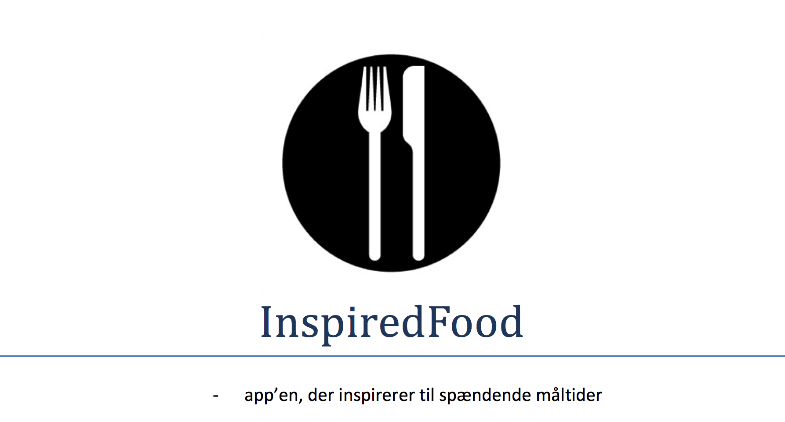

**Fag:	Programmering af mobile enheder**

**Hold:	s17apme1pab1**

**Vejleder:	Anders Kalhauge**

**Deltagere:	Pia Jensen & Carsten Brandt**

# Problemformulering
Som afslutning på faget Programmering Af Mobile Enheder har vi fået til opgave at udvikle en app med valgfrit indhold. Applikationen skal udvikles til Android-styresystemet og skal skrives i det nye programmeringssprog Kotlin.

Vi har besluttet os for at lave en kogebogs-app med titlen InspiredFood, som dels skal fungere som et opslagsværk og give inspiration til valg af madretter, og dels give mulighed for features som en traditionel kogebog ikke kan tilbyde, såsom anvendelse af timere og afsendelse af indkøbslister pr. SMS.

Det er tillige vores ambition, at app’en skal være enkel og overskuelig i sit design og nem at anvende for alle brugere.

Vi vil i udviklingsarbejdet benytte os af den agile metode Pair Programming, da den giver os mulighed for løbende at diskutere alternative løsninger, søge oplysninger imens vi udvikler app’en og, forhåbentlig, give bedre læring for os begge.

# Installationsvejledning
Kotlin-sproget og Android-styresystemet er under stadig udvikling, og for at kunne anvende de seneste forbedringer har vi valgt at udvikle vores App til de nyeste versioner af begge dele – disse skal derfor installeres for at kunne afvikle app’en.
Ligeledes har vi valgt den relativt nye Motorola Nexus 6-telefon som vores ”target platform”, da app’en er designet til en skærm af en vis størrelse. Vælg derfor denne type telefon, når emulatoren skal startes op.

# Brugervejledning
App’en fungerer både på dansk og engelsk og indstiller sig automatisk til det sprog, som er valgt på telefonen. I nedenstående vejledning har vi taget udgangspunkt i den danske version.
Ved start af app’en vises først en kort splash-skærm med InspiredFood-logoet (en sort/hvid grafik forestillende en tallerken og bestik).

## Hovedmenu
Efter splash-skærmen kommer man til hovedmenuen, som er delt op i en fast sektion i toppen indeholdende App-navnet og diverse knapper, og en scrollende sektion, hvor alle madretterne vises i en liste:

